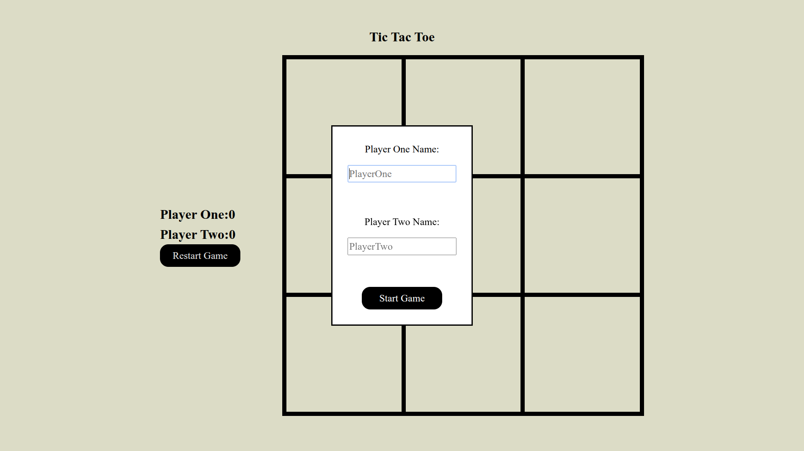
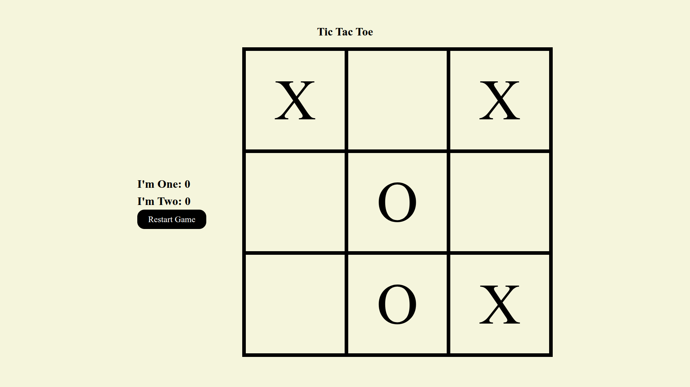
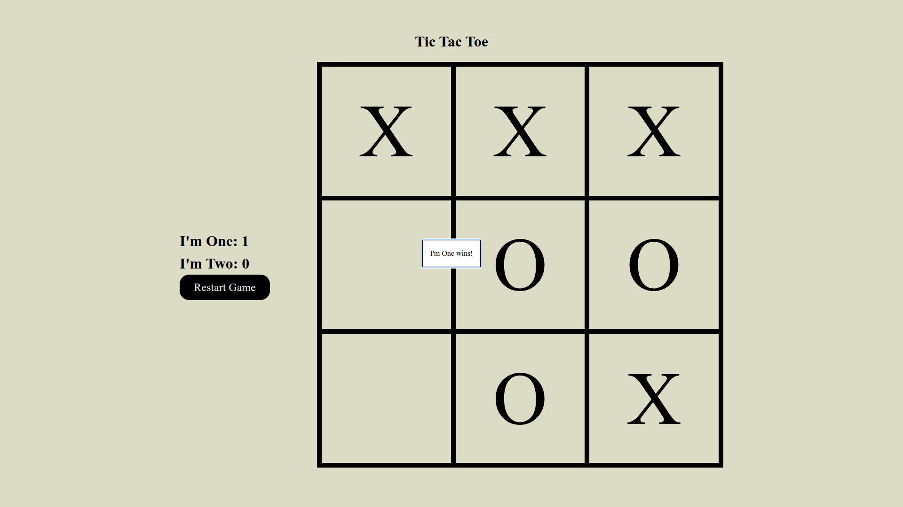

# Tic Tac Toe

Project created for [Project Odin](https://www.theodinproject.com/lessons/node-path-javascript-tic-tac-toe)

## Features 

A game of tic tac toe for two players.

Upon start provide your usernames.

Play the game by clicking on squares within grid.

On Players win the score updates. By clicking outside the dialog board resets.

## Live Preview 

To see this website live click this [Link](https://devoid-of-thought.github.io/odin-tic-tac-toe/)